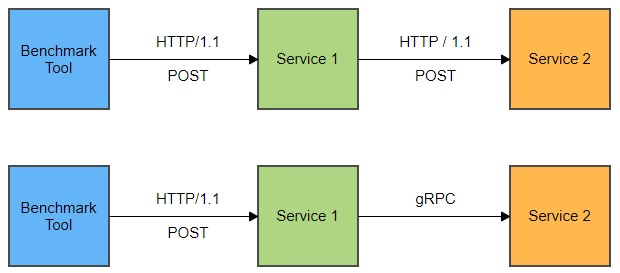

# http-vs-grpc



```bash
vegeta attack -targets=vegeta-target -duration=30s -rate=0 -max-workers=3 -timeout=5s | vegeta report
```

```bash
curl -v http://127.0.0.1:8080/user -H "Content-Type: application/json" --data "{\"id\":1234}"
*   Trying 127.0.0.1:8080...
* Connected to 127.0.0.1 (127.0.0.1) port 8080 (#0)
> POST /user HTTP/1.1
> Host: 127.0.0.1:8080
> User-Agent: curl/7.79.1
> Accept: */*
> Content-Type: application/json
> Content-Length: 11
>
* Mark bundle as not supporting multiuse
< HTTP/1.1 200 OK
< Date: Thu, 10 Feb 2022 09:54:49 GMT
< Content-Length: 385
< Content-Type: text/plain; charset=utf-8
<
{"id":1234,"user":{"first_name":"FirstName","last_name":"LastName","email":"firstname.lastname@email.moo","gender":"yes"},"ip_address":["127.0.0.1","192.168.0.1","10.10.10.10","0.0.0.0"],"date":"2022-02-10T10:54:49.3785219+01:00","cars":[{"make":"Honda","model":"Civic","color":"Blue"},{"make":"Mercedes","model":"Cla","color":"Black"},{"make":"Ford","model":"Focus","color":"Gray"}]}
* Connection #0 to host 127.0.0.1 left intact
```

```json
{
  "id": 1234,
  "user": {
    "first_name": "FirstName",
    "last_name": "LastName",
    "email": "firstname.lastname@email.moo",
    "gender": "yes"
  },
  "ip_address": [
    "127.0.0.1",
    "192.168.0.1",
    "10.10.10.10",
    "0.0.0.0"
  ],
  "date": "2022-02-10T10:33:39.6541902+01:00",
  "cars": [
    {
      "make": "Honda",
      "model": "Civic",
      "color": "Blue"
    },
    {
      "make": "Mercedes",
      "model": "Cla",
      "color": "Black"
    },
    {
      "make": "Ford",
      "model": "Focus",
      "color": "Gray"
    }
  ]
}
```